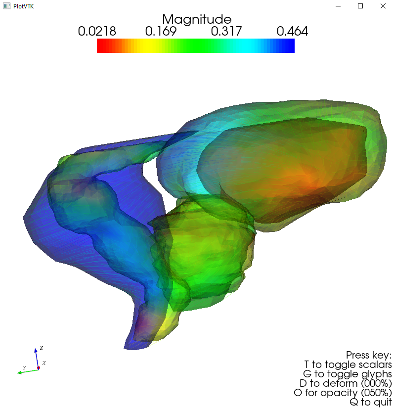

# PlotVTK

## Table of contents
* [General info](#general-info)
* [Example](#example)
* [Dependencies](#dependencies)

## General info
Bastien Rigaud, PhD
Laboratoire Traitement du Signal et de l'Image (LTSI), INSERM U1099
Campus de Beaulieu, Université de Rennes 1
35042 Rennes, FRANCE
bastien.rigaud@univ-rennes1.fr

## Example 

<p align="center">
    

</p>

```
    filepath = r'C:\Data\Data_test\test_2.vtk'
    reader1 = vtk.vtkPolyDataReader()
    reader1.ReadAllScalarsOn()
    reader1.ReadAllVectorsOn()
    reader1.SetFileName(filepath)
    reader1.Update()
    polydata1 = reader1.GetOutput()

    filepath = r'C:\Data\Data_test\test.vtk'
    reader2 = vtk.vtkPolyDataReader()
    reader2.ReadAllScalarsOn()
    reader2.ReadAllVectorsOn()
    reader2.SetFileName(filepath)
    reader2.Update()
    polydata2 = reader2.GetOutput()

    transform = vtk.vtkTransform()
    transform.RotateWXYZ(10, 1, 0, 0)
    transformFilter_1 = vtk.vtkTransformPolyDataFilter()
    transformFilter_1.SetTransform(transform)
    transformFilter_1.SetInputData(polydata1)
    transformFilter_1.Update()
    polydata1_transformed = transformFilter_1.GetOutput()

    transformFilter_2 = vtk.vtkTransformPolyDataFilter()
    transformFilter_2.SetTransform(transform)
    transformFilter_2.SetInputData(polydata2)
    transformFilter_2.Update()
    polydata2_transformed = transformFilter_2.GetOutput()

    plot_vtk([polydata1, polydata2], secondary=[polydata1_transformed, polydata2_transformed])
```

## Dependencies

Run:
```
pip install -r requirements.txt
```
